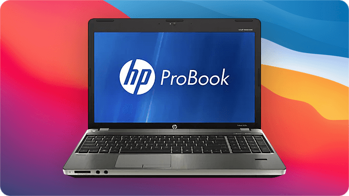
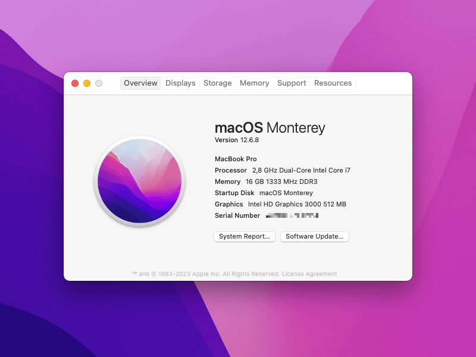
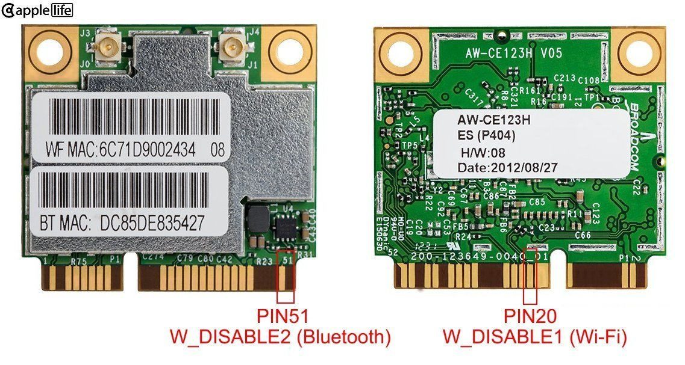

<p align="center"></p>
<h1 align="center">ProBook 4x30s OpenCore</h1>
<h3 align="center">4330s / 4530s / 4730s</h3>

I have an old Hewlett-Packard laptop: [HP ProBook 4530s](https://support.hp.com/us-en/product/hp-probook-4530s-notebook-pc/5060880). The tough bastard has a stylish metal frame, great chiclet-style scissor keyboard, and it stubbornly refuses to die after all these years. There are several things you could do with an old laptop, but thanks to marvels of modern software engineering and in particular, – [OpenCore](https://github.com/acidanthera/OpenCorePkg), – at least some laptops might have a brighter perspective. So instead of throwing it away or ~[turning](https://en.wikipedia.org/wiki/Zombie) it into a boring Linux file server~, we will be putting macOS on it, – and not just some outdated version, but a modern one.



This repository contains OpenCore [EFI folder](https://github.com/ubihazard/probook-4x30s/releases/download/v1.1/EFI-0.9.4-5afed6e.zip "Download") with everything needed to run modern versions of [macOS](https://support.apple.com/macos) on old HP ProBook 4x30s series Sandy Bridge laptops: with little [adjustments](#restoring-power-management) for your particular laptop. Only models with integrated Intel HD 3000 graphics are supported. Other models, such as with AMD GPUs, will require additional steps to [turn their dedicated GPU off](#disabling-dedicated-gpu) since it likely isn‘t supported by macOS. In any case, it is highly recommended that you read the official [install guide](https://dortania.github.io/OpenCore-Install-Guide/ "OpenCore install guide") before attempting the actual setup.

| **Name**[^1] | Description
| ------------ | -----------
| **CPU**      | Intel Core i7-2640M
| **RAM**      | 16 GB DDR3
| **SSD**      | 512 GB
| **Wi-Fi & Bluetooth** | Broadcom BCM94352HMB / Atheros AR9285
| **Ethernet** | Realtek RTL8111
| **USB 3.0**  | NEC Renesas uPD720200
| **Card reader** | JMicron JMB38X
| **DVD drive** | HP DVD-RW AD-7740H
| **macOS**    | Monterey 12.6.8 / High Sierra 10.3.6
| **OpenCore** | [0.9.4-5afed6e](https://github.com/ubihazard/OpenCorePkg-ProBook/releases/tag/v0.9.4-5afed6e) for ProBook 4x30s
| **OCLP** | [0.6.8](https://github.com/dortania/OpenCore-Legacy-Patcher/releases/tag/0.6.8)

[^1]: Everything works. USB 3.0 works up to Catalina. Web cam might not work in some apps due to Metal: depends on the app‘s and macOS‘ version. USB 2.0 and Bluetooth need proper [USB port mapping](#acpi-aka-dsdt-patching).

Although this laptop is very old, macOS works surprisingly well on it with pretty much full compatibility. You can expect relatively smooth web browsing experience, word processing, and coding light projects in VS Code (nothing too demanding). Don‘t expect running XCode with iOS simulator on it though. It can also help you manage your iThings if you don‘t already have a Mac.

Getting your laptop ready
-------------------------

Before you begin, it is recommended that you consider upgrading your ProBook. All of its off-the-shelf configurations are hopelessly outdated by now, but thanks to its age most components from that time are sold dirt cheap on used markets and Aliexpress.

### SSD

Definitely upgrade HDD to a minimum 256 GB SATA SSD drive (128 GB can be enough for very light use). Modern versions of macOS use APFS file system which is specifically designed for solid-state drives. Although you can install macOS on a HDD, the performance penalty would likely be too high.

### CPU & RAM

It is highly recommended that you install at least 8 GB of RAM and change your processor to at least Core i5 with Turbo Boost (in case if you are stuck with Core i3). You would want to disassemble your laptop anyway to clean it and change thermal paste, so why not upgrade CPU in the process? My personal CPU recommendation, however, would be a dual-core Core i7, namely [2.8 GHz 2640M](https://ark.intel.com/content/www/us/en/ark/products/53464/intel-core-i72640m-processor-4m-cache-up-to-3-50-ghz.html "Core i7-2640M") or 2.7 GHz 2620M (whichever you can still buy). I would advice against quad-core 2670QM and especially 2760QM or higher, and for many reasons. For one, your laptop‘s power adapter might not provide enough watts for the whole system. Then, ProBook‘s mainboard doesn‘t possess enough power phases to properly feed hungry quad-core i7 CPUs with TDP of 45+ W. Lastly, the cooling system is simply inadequate for a quad-core CPU: having just one short heat pipe.

Failure to observe these hardware restrictions will result in your CPU quickly overheating, not having Turbo Boost or not running even at its stock advertised speed, VRM running very hot, and laptop abruptly shutting down. And on top of all that, even the fastest 45 W Core i7 CPU, – 2860QM, – is still whole 300 MHz slower on all cores than 35 W 2640M. Taking power and thermal limits into account, a 2640M with two but powerful cores is just a better overall option. This is especially true when compared to 2670QM with its miserable (by modern standards) 2.2 GHz stock clock speed.

For reference, my dual-core Core i7-2640M with high-quality TIM applied hits **95** degrees under full continuous load (compilation of a big C/C++ project), – just a couple degrees shy of thermal throttling.

### Wi-Fi

Depending on a version of macOS you would choose to install, you might also need to change your wireless adapter to a compatible one. This is not going to be easy because ProBook 4x30s suffers from a dreaded BIOS Wi-Fi whitelist. Luckily, there are workarounds. You can install a compatible Atheros card and [rebrand it](https://web.archive.org/web/20230315063103/https://www.tonymacx86.com/threads/rebranding-the-atheros-928x-cards-the-guide.115110/) to pass whitelist check (Big Sur), or you can try going for Broadcom BCM94352HMB (Monterey). The latter would require BIOS Wi-Fi whitelist [bypass hack](#broadcom-wi-fi) and a hardware mod on a card itself: you will need to mask certain PCB contacts with tiny pieces of kapton tape to prevent HP firmware from turning the Wi-Fi module off. (Without this mod only Bluetooth side will work.)



Chances are you already have a compatible Atheros AR9285 adapter so you can just install Big Sur without bothering with hardware modding.

Alternatively, Intel Wi-Fi modules have recently became a viable option with [itlwm](https://github.com/OpenIntelWireless/itlwm "macOS Intel wireless kexts"). You can try making your Intel Wi-Fi work by copying itlwm kext(s) to EFI kexts folder and adding them in OpenCore `config.plist`. Anyway, Intel Wi-Fi setup won‘t be covered here.

Whatever your choice of card would be, it must be of *half-size mini PCIe* form factor, *not M2*.

OpenCore for ProBook
--------------------

This guide now uses a [custom build](https://github.com/ubihazard/OpenCorePkg-ProBook/releases) of OpenCore put together by me. It includes two EFI modules made specifically for ProBook 4x30s: ~BIOS fan reset~ *(do not use – this module causes HD 3000 graphical artifacts)* and BIOS Wi-Fi whitelist bypass.

**Do not use these EFI modules with any other laptop other than ProBook 4330s, 4530s, or 4730s. Doing so can brick your device!**

~`ProBookFanReset.efi` resets fan control from macOS back to automatic BIOS control.~ `ProBookWifiWhlistOff.efi` is necessary if you [plan to install](#wi-fi) a non-whitelisted (not approved by HP) Wi-Fi card in your laptop.

ACPI (DSDT patching)
--------------------

Most [ACPI patches](https://github.com/RehabMan/HP-ProBook-4x30s-DSDT-Patch) for this laptop (and other ProBooks, EliteBooks, and ZBooks) were made by legendary [RehabMan](https://github.com/RehabMan).

However, I wasn‘t able to make his “hot patch” SSDTs work with OpenCore. I don‘t know if it‘s because they were made with Clover in mind or if there‘s some other reason. Looking at their code, they appear to be rather complex and utilize custom `RMCF` “RehabMan configuration” device definition block. Regardless, SSDTs provided by Dortania in their [Sandy Bridge laptop guide](https://dortania.github.io/OpenCore-Install-Guide/config-laptop.plist/sandy-bridge.html "Sandy Bridge laptop guide") do happen to work just fine, – but pay attention to `SSDT-PM`. Though I did carefully port the rest of ACPI patches from RehabMan‘s original Clover config to OpenCore config format.

What‘s left is correct USB port mapping. The USB port map kexts in this repo are for ProBook 4530s models with USB 3.0 port. If you have a different mainboard (such as with all USB 2.0 ports) or if port mapping doesn‘t match for some other reason, you would have to re-map your USB ports by means of creating your own version of `USBMap.kext`. This procedure is fully covered in Dortania [guide](https://dortania.github.io/OpenCore-Post-Install/usb/ "USB port mapping guide") and I won‘t be duplicating it here.

Kernel extensions
-----------------

Kernel extensions, or “kexts”, are required for proper hardware support by macOS. There isn‘t much more to say here: all required kexts are already assembled in one place in the provided EFI OpenCore folder. Though you might need to disable some and enable others to adjust for your particular system (`Kernel/Add`).

### Atheros Wi-Fi

Enable `BigSur/IOath3kfrmwr.kext`, `IOath3kfrmwr.kext`, `IOath3kdevice.kext`, `HS80211Family.kext`, `AirPortAtheros40.kext`, `ProBookAtheros.kext`, and `WifiLocFix.kext` (`Enabled` -> `true`).

```xml
      <dict>
        <key>Arch</key>
        <string>Any</string>
        <key>BundlePath</key>
        <string>AirPortAtheros40.kext</string>
        <key>Comment</key>
        <string>AirPortAtheros40.kext</string>
        <key>Enabled</key>
        <true/>
        <key>ExecutablePath</key>
        <string>Contents/MacOS/AirPortAtheros40</string>
        <key>MaxKernel</key>
        <string>20.9.9</string>
        <key>MinKernel</key>
        <string>18.0.0</string>
        <key>PlistPath</key>
        <string>Contents/Info.plist</string>
      </dict>
```

Disable `AirportBrcmFixup.kext` (and its plugins), `BlueToolFixup.kext`, `BrcmBluetoothInjector.kext`, `BrcmFirmwareData.kext`, `BrcmPatchRAM3.kext`, and `BrcmPatchRAM2.kext` (`Enabled` -> `false`).

```xml
      <dict>
        <key>Arch</key>
        <string>Any</string>
        <key>BundlePath</key>
        <string>AirportBrcmFixup.kext</string>
        <key>Comment</key>
        <string>AirportBrcmFixup.kext</string>
        <key>Enabled</key>
        <false/>
        <key>ExecutablePath</key>
        <string>Contents/MacOS/AirportBrcmFixup</string>
        <key>MaxKernel</key>
        <string></string>
        <key>MinKernel</key>
        <string></string>
        <key>PlistPath</key>
        <string>Contents/Info.plist</string>
      </dict>
```

Open `WifiLocFix.kext/Contents/Info.plist` and change the country code (`US`) and locale (`FCC` or `ETSI`):

```xml
      <dict>
        <key>IO80211CountryCode</key>
        <string>US</string>
        <key>IO80211Locale</key>
        <string>FCC</string>
      </dict>
```

### Broadcom Wi-Fi

Do the other way around. Mojave and below: enable `BrcmBluetoothInjector.kext` and disable `BrcmPatchRAM2.kext`. If you don‘t get Wi-Fi it means your card needs a [firmware uploader](https://github.com/acidanthera/BrcmPatchRAM#brcmbluetoothinjectorkext), so switch them around. *Do not use `BrcmPatchRAM2.kext` together with `BrcmBluetoothInjector.kext`, or you‘ll get kernel panics.* Add Broadcom configuration parameters to OpenCore `config.plist` `boot-args` with your country code (`NVRAM/Add/7C436110-AB2A-4BBB-A880-FE41995C9F82`):

```xml
        <key>boot-args</key>
        <string>-no_compat_check amfi_get_out_of_my_way=1 brcmfx-driver=1 brcmfx-country=US</string>
```

**For ProBook 4x30s series only:** enable Wi-Fi BIOS whitelist bypass EFI driver in `UEFI/Drivers` (`Enabled` -> `true`):

```xml
      <dict>
        <key>Arguments</key>
        <string></string>
        <key>Comment</key>
        <string>ProBookWifiWhlistOff.efi</string>
        <key>Enabled</key>
        <true/>
        <key>LoadEarly</key>
        <false/>
        <key>Path</key>
        <string>ProBookWifiWhlistOff.efi</string>
      </dict>
```

**Do not use this driver with any other laptop: doing so can brick your device!**

You might also need to add `SSDT-ARPT-RP0X-BCM4352.aml` to your EFI ACPI folder and `config.plist` for native Airport support. You can get it from [toleda wireless half-mini repo](https://github.com/toleda/wireless_half-mini/tree/master/ssdt_arpt "Airport BCM4352 SSDT"): follow instructions on the linked page to find out which one you need (`ACPI/Add`, `Enabled` -> `true`).

```xml
      <dict>
        <key>Comment</key>
        <string>SSDT-ARPT-RP04-4352.aml</string>
        <key>Enabled</key>
        <true/>
        <key>Path</key>
        <string>SSDT-ARPT-RP04-4352.aml</string>
      </dict>
```

In my case this SSDT wasn‘t needed.

### Intel Wi-Fi

Sorry, you are on your own here.

What macOS version to install
-----------------------------

The recommended macOS version(s) to install is ~Sierra~ High Sierra together with Big Sur. High Sierra is the last version of macOS with native support for Intel HD 3000 graphics and Atheros Wi-Fi. And Big Sur is just modern enough for everyday use (sans Metal acceleration), although it requires additional patched kexts to recover removed hardware support. Having them both installed side-by-side would offer best of both worlds: use whatever you can on High Sierra and hop onto Big Sur for incompatible apps, such as modern browser. Definitely go with just Big Sur alone if you can‘t afford enough storage space for both.

Mojave and Catalina (especially Catalina) is *not recommended*. They aren‘t supported well by the OpenCore Legacy Patcher (OCLP), which is used to restore legacy HD 3000 graphics acceleration, and Catalina in particular was released at a time when Hackintosh community was transitioning from Clover to OpenCore. As a result, it suffers form likewise poor support form both Clover and OpenCore. (This is on top of being buggy and problematic even on real Macs.)

But can it run Monterey?
------------------------

if you managed to find and swapped in a compatible Wi-Fi card, you can bump installed macOS version to Monterey. The caveat is that support for Bluetooth on these cards (any compatible card you can install in this laptop) on Monterey is sketchy at best: Airdrop, Handoff, and certain Continuity features might not work at all, would work but with issues, or only in one direction (from iPhone to ProBook, but not the other way around). So keep that in mind.

Installing macOS Ventura
------------------------

macOS Ventura requires a CPU with AVX2 instructions which all Sandy Bridge CPUs lack. (AVX2 becomes available since Haswell.) Thus, Monterey is the final version of macOS you can normally install on this laptop. That is, unless you are willing to go down the rabbit hole of [Cryptex](https://github.com/acidanthera/CryptexFixup) patching.

This isn‘t supported by this guide and is highly *not recommended*. Even if you manage to boot Ventura and use apps that directly come with it, pretty much any third-party app designed to run on Ventura would expect AVX2 to be available and as such won‘t be usable on your system.

So this remains an option only for maniacs willing to accomplish just this task of “successfully” running Ventura on an unsupported Sandy Bridge system, – for bragging rights.

Installing macOS Sonoma
-----------------------

Please. Stop.

Use separate config for installer
---------------------------------

For USB installer you will need a slightly different OpenCore `config.plist` modified specifically for installing macOS. It disables some kexts which are useless during installation (Wi-Fi, Bluetooth, card reader, etc.), doesn’t modify SIP flags, enables verbose boot (kernel text messages), and has a different SMBIOS Mac model which allows to install ~Big Sur~ Monterey.

Grab it [directly](/EFI/OC/config.plist "USB installer OpenCore config") from this repository (not from releases page).

Disabling dedicated GPU
-----------------------

For laptop models with dedicated GPU soldered onto motherboard an additional `-wegnoegpu` [boot argument](https://github.com/acidanthera/WhateverGreen "WhateverGreen configuration") is needed in `config.plist`:

```xml
        <key>boot-args</key>
        <string>-no_compat_check amfi_get_out_of_my_way=1 -wegnoegpu</string>
```

This causes all dedicated GPUs to be disabled. Make sure to also disable dGPU in your laptop‘s BIOS.

APFS driver version
-------------------

OpenCore from the provided EFI folder will load any APFS driver available. This is done to make initial setup easier in case of multiple macOS installations (e.g. High Sierra together with Big Sur). For security reasons, it is recommeded that after installation you would [change](https://dortania.github.io/OpenCore-Install-Guide/config-laptop.plist/sandy-bridge.html#apfs) the minimum allowed APFS driver version according to the latest macOS version you have installed. For Big Sur and above, leave both `MinVersion` and `MinDate` at `0`.

Restoring graphics acceleration and a note on Metal support
-----------------------------------------------------------

One of the first [post-installation](https://dortania.github.io/OpenCore-Post-Install/ "Post-installation guide") tasks you will have to perform, unless you decided to stay on High Sierra, is restoring graphics acceleration along with native desktop resolution.

Intel HD 3000 doesn‘t support Metal graphics acceleration API found on modern macOS since High Sierra. And since Mojave, HD 3000 itself isn‘t supported at all: you need to use [OpenCore Legacy Patcher](https://github.com/dortania/OpenCore-Legacy-Patcher "OCLP") to install patched kexts that restore graphics acceleration and work-around Metal requirements in the system.

Applications that require Metal can be replaced with their older non-Metal versions. Usually they work on Big Sur just fine.

Restoring power management
--------------------------

After installing macOS, copying the provided EFI folder to your EFI system partition for booting without a USB drive, and after fixing graphics, the next step is configuring proper CPU power management with the help of `SSDT-PM.aml` SSDT table. This table is specific to each CPU and cannot be pre-made.

Without this step `AppleIntelCPUPowerManagement.kext` would cause kernel panic so `NullCPUPowerManagement.kext` is temporarily used to overtake control from it.

  * Follow the Dortania [guide](https://dortania.github.io/OpenCore-Post-Install/universal/pm.html#sandy-and-ivy-bridge-power-management) to create `SSDT-PM.aml` for the CPU installed in your laptop.

  * Mount your EFI system partition:

    ```bash
    diskutil list
    sudo diskutil mount diskXsY
    ```

    (Replace `X` and `Y` with your EFI disk identifier.)

  * Copy the `ssdt.aml` [generated](https://github.com/Piker-Alpha/ssdtPRGen.sh "ssdtPRGen.sh") by `ssdtPRGen.sh` script to your EFI folder:

    ```bash
    cp ~/Library/ssdtPRGen/ssdt.aml /Volumes/EFI/EFI/OC/ACPI/SSDT-PM.aml
    ```

  * Re-enable CPU power management in OpenCore `config.plist` (`ACPI/Add`, `Enabled` -> `true`):

    ```xml
          <dict>
            <key>Comment</key>
            <string>SSDT-PM.aml</string>
            <key>Enabled</key>
            <true/>
            <key>Path</key>
            <string>SSDT-PM.aml</string>
          </dict>
    ```

  * Restore OEM CPU tables (`ACPI/Delete`, `Enabled` -> `false`):

    ```xml
          <key>Delete</key>
          <array>
            <dict>
              <key>All</key>
              <false/>
              <key>Comment</key>
              <string>Delete CpuPm</string>
              <key>Enabled</key>
              <false/>
              <key>OemTableId</key>
              <data>Q3B1UG0AAAA=</data>
              <key>TableLength</key>
              <integer>0</integer>
              <key>TableSignature</key>
              <data>U1NEVA==</data>
            </dict>
            <dict>
              <key>All</key>
              <false/>
              <key>Comment</key>
              <string>Delete Cpu0Ist</string>
              <key>Enabled</key>
              <false/>
              <key>OemTableId</key>
              <data>Q3B1MElzdAA=</data>
              <key>TableLength</key>
              <integer>0</integer>
              <key>TableSignature</key>
              <data>U1NEVA==</data>
            </dict>
          </array>
    ```

  * Disable `NullCPUPowerManagement.kext` (`Kernel/Add`, `Enabled` -> `false`):

    ```xml
          <dict>
            <key>Arch</key>
            <string>Any</string>
            <key>BundlePath</key>
            <string>NullCPUPowerManagement.kext</string>
            <key>Comment</key>
            <string>NullCPUPowerManagement.kext</string>
            <key>Enabled</key>
            <false/>
            <key>ExecutablePath</key>
            <string>Contents/MacOS/NullCPUPowerManagement</string>
            <key>MaxKernel</key>
            <string></string>
            <key>MinKernel</key>
            <string></string>
            <key>PlistPath</key>
            <string>Contents/Info.plist</string>
          </dict>
    ```

If you went with Monterey, make sure `ASPP-Override.kext` is enabled, because it is required to restore Sandy Bridge CPU power management, which was at some point removed in Monterey (and might be removed in Big Sur as well in the future):

```xml
      <dict>
        <key>Arch</key>
        <string>Any</string>
        <key>BundlePath</key>
        <string>ASPP-Override.kext</string>
        <key>Comment</key>
        <string>ASPP-Override.kext</string>
        <key>Enabled</key>
        <true/>
        <key>ExecutablePath</key>
        <string></string>
        <key>MaxKernel</key>
        <string></string>
        <key>MinKernel</key>
        <string>21.4.0</string>
        <key>PlistPath</key>
        <string>Contents/Info.plist</string>
      </dict>
```

Fixing blur effects in Big Sur and Monterey
-------------------------------------------

In Big Sur (and later) transparent effects, such as blur, render incorrectly on non-Metal GPUs (HD 3000 is not capable of Metal API). After installing [patched graphics kexts](#restoring-graphics-acceleration-and-a-note-on-metal-support) with OCLP it becomes possible to fall back to legacy blur drawing method:

```bash
defaults write -g Moraea_BlurBeta -bool true
```

You might also experiment with different blur strength, style of dark window borders, and dark menu bar text:

```bash
defaults write -g ASB_BlurOverride -float 30
defaults write -g Moraea_RimBeta -bool true
defaults write -g Moraea_DarkMenuBar -bool true
```

In Monterey you can get noticeable performance improvement by enabling reduced transparency mode in Accessibility settings. (This mode is broken on Big Sur with patched kexts, rendering the menu bar unusable.) With this on, you can now selectively re-enable transparency and blur for the dock:

```bash
defaults write com.apple.dock Moraea_EnableTransparency 1
```

Log out and back in to see the changes. Some of these [commands](https://moraea.github.io/Docs/defaults.html), like `Moraea_EnableTransparency`, require a reboot to be applied.

HD 3000 graphical glitches
--------------------------

Intel HD 3000 on non-Apple hardware is known to be plagued by graphical artifacts. They can occur even with 8 GB of RAM installed and are manifested in the form of grey lines or blocks suddenly popping around. Most annoyingly, the system eventually freezes and becomes completely unresponsive, except mouse cursor still moving on the screen.

The solution to this problem turns out to be quite simple: perform an EC reset (“EC” stands for “embedded controller”) and *do not boot into anything other than macOS*: no Windows, no Linux live USBs, etc.

An EC reset is performed by disconnecting your laptop from all power sources (AC adapter and battery) and pressing and holding the power button for 30 seconds. Make sure to hold the button for no less than 30 seconds. If in doubt, hold it for several seconds longer, – it won‘t hurt.

Apparently, there‘s something low-level going on in the code that handles the platform and it messes up with EC in a way that is incompatible between operating systems. I.e. macOS “configures” it in its own way and this results in glitches now happening, for example, on Ubuntu, – and the other way around.

This means dual-booting Linux or Windows with macOS on this laptop is *not an option*.

And for this reason also, *avoid using any ACPI “fan patches”* (quiet, RehabMan, etc.), such as `HPFanReset.efi`, as they write to EC causing the aformentioned corruption.

Increasing HD 3000 VRAM
-----------------------

With HD 3000 it is possible to change the maximum amount of video ram macOS allocates for the GPU. You can either enable the patch in `config.plist` or apply it manually. Additionally, the `AppleIntelHD3000Graphics` kext `Contents/Info.plist` has to be [modified](https://github.com/ubihazard/macos-scripts/tree/main/Scripts#root-patching "Root patching guide") to complete the patch:

```xml
      <key>VRAMOverride</key>
      <integer>1536</integer>
```

The OC `config.plist` patch doesn’t seem to work in Big Sur with OCLP-installed HD 3000 kexts. Instead, the `AppleIntelSNBGraphicsFB.kext` (“Sandy Bridge graphics framebuffer”) has to be [modified directly](https://github.com/ubihazard/macos-scripts/tree/main/Scripts#root-patching "Root patching guide") with the help of binary hexadecimal editor.

If you got 8 GB of system RAM:

| **VRAM size** | Hex find   | Hex replace | Base64 find | Base64 replace
| ------------- | ---------- | ----------- | ----------- | --------------
| **768**       | d000000020 | d000000030  | 0AAAACA=    | 0AAAADA=
| **1024**      | d000000020 | d000000040  | 0AAAACA=    | 0AAAAEA=
| **1536**      | d000000020 | d000000060  | 0AAAACA=    | 0AAAAGA=

For 4 GB of system RAM (not recommended):

| **VRAM size** | Hex find   | Hex replace | Base64 find | Base64 replace
| ------------- | ---------- | ----------- | ----------- | --------------
| **512**       | d000000018 | d000000020  | 0AAAABg=    | 0AAAACA=
| **768**       | d000000018 | d000000030  | 0AAAABg=    | 0AAAADA=
| **1024**      | d000000018 | d000000040  | 0AAAABg=    | 0AAAAEA=

The provided values are for High Sierra version of the kext. Sierra and below have [different values](https://web.archive.org/web/20201112022015/https://www.insanelymac.com/forum/topic/320001-increase-vram-hd-3000/ "Sierra HD 3000 VRAM patching").

Don’t forget to [rebuild the kernel cache](https://github.com/ubihazard/macos-scripts/tree/main/Scripts#rebuild-kernel-cache "Kernel cache rebuild guide") after the patch and then reboot to test your changes.

Brightness adjustment after EDID injection
------------------------------------------

If you inject custom EDID for your internal display you will notice that `Fn` brightness adjustment keys will no longer function and the brightness slider in Big Sur would also show up as disabled in control center area. The reason for this is that in case of custom EDID injection macOS insists on having a particular value in device id field of your EDID. You can use the [edidparser.rb](https://github.com/ubihazard/probook-4x30s/releases/download/v1.0/edidparser.rb "Custom EDID fix") script to extract your current EDID and patch it for brightness keys to work again. This script isn’t my work and is provided as-is.

Configuring trackpad
--------------------

Since your laptop battery is probably long dead, macOS would not recognize it. And without a recognized battery modern versions of macOS also prevent changing trackpad settings (go figure).

In reality the trackpad is fully working, – you just can’t access its settings. In order to configure it you would have to manually edit the binary `.plist` file at `~/Library/Preferences/com.apple.AppleMultitouchTrackpad.plist`.

Copy it to your desktop and convert it from binary format to XML:

```bash
cd ~/Dekstop
cp ~/Library/Preferences/com.apple.AppleMultitouchTrackpad.plist ./
plutil -convert xml1 com.apple.AppleMultitouchTrackpad.plist
```

Make your edits (make sure the syntax is correct) and convert the XML config back into binary format:

```bash
nano com.apple.AppleMultitouchTrackpad.plist
plutil -convert binary1 com.apple.AppleMultitouchTrackpad.plist
```

Replace the original file with your edited copy:

```bash
cp com.apple.AppleMultitouchTrackpad.plist ~/Library/Preferences/
```

*Rebooting is required to make it work. (Assuming you also didn‘t make any mistakes while editing the file.)*

A pre-made trackpad configuration file with tap to click is [provided](/Library/Preferences/com.apple.AppleMultitouchTrackpad.plist "Trackpad config") and should suit most users well. Copy it to `~/Library/Preferences` replacing the original.

Calculating KASLR value
-----------------------

If you system fails to boot for no apparent reason with messages like:

```
Error allocating 0x1197b pages at 0x0000000017a80000 alloc type 2
Couldn't allocate runtime area
```

KASLR (kernel address space layout randomization) might be a problem.

To fix this you can either try using one of the [AptioMemoryFix](https://github.com/acidanthera/AptioFixPkg) drivers or set `DevirtualiseMmio` to `true` and [manually calculate](https://dortania.github.io/OpenCore-Install-Guide/extras/kaslr-fix.html "KASLR slide guide") the slide value.

In my case the slide value resulted in **8**, which is set in the `config.plist` (`NVRAM/Add/7C436110-AB2A-4BBB-A880-FE41995C9F82`):

```xml
        <key>boot-args</key>
        <string>-no_compat_check amfi_get_out_of_my_way=1 slide=8</string>
```

Disabling SIP
-------------

Due to extensive modifications required to support this laptop on modern macOS it is better to disable SIP right away (`NVRAM/Add/7C436110-AB2A-4BBB-A880-FE41995C9F82`):

```xml
        <key>csr-active-config</key>
        <data>AwgAAA==</data>
```

The configured value is `0x803`.

Filling your system information
-------------------------------

The final step to setting up your new hackintosh laptop is generating serial numbers and system UUID. You can skip this step if you don‘t plan to use App store or connect with Apple, otherwise it is required to make iCloud or iMessage to work.

First, you need to choose the Mac product name closest to your hardware. For this laptop model it would be `MacBookPro8,1`. Now you can use `macserial` tool from OpenCore utilities to generate serials (`SystemSerialNumber` and `MLB`, or “motherboard serial number”):

```bash
./macserial -m 'MacBookPro8,1' -n 1
```

The system serial number you generated must be reported as “invalid” or “not found” on Apple [support coverage](https://checkcoverage.apple.com/ "Serial number check") page. If it‘s valid, it means it belongs to an actual Mac, and you must generate another serial number and check it again.

Next, find out your ethernet adapter MAC address and strip it of `:` characters, – this would be your `ROM`:

```bash
ifconfig
```

Encode your `ROM` value in Base64:

```bash
echo AABBCCXXYYZZ | base64
```

Finally, generate the `SystemUUID` for your ProBook:

```bash
uuidgen
```

Now we can fill this information in `config.plist` (`PlatformInfo/Generic`):

```xml
    <key>Generic</key>
    <dict>
      <key>AdviseFeatures</key>
      <false/>
      <key>MLB</key>
      <string>W8900000000000000</string>
      <key>MaxBIOSVersion</key>
      <false/>
      <key>ProcessorType</key>
      <integer>0</integer>
      <key>ROM</key>
      <data>AABBCCXXYYZZ</data>
      <key>SpoofVendor</key>
      <true/>
      <key>SystemMemoryStatus</key>
      <string>Auto</string>
      <key>SystemProductName</key>
      <string>MacBookPro8,1</string>
      <key>SystemSerialNumber</key>
      <string>W89000000000</string>
      <key>SystemUUID</key>
      <string>XXXXXXXX-XXXX-XXXX-XXXX-XXXXXXXXXXXX</string>
    </dict>
```

Firefox not starting on Monterey
--------------------------------

Add `ipc_control_port_options=0` to your OpenCore `config.plist` `boot-args`:

```xml
        <key>boot-args</key>
        <string>-no_compat_check amfi_get_out_of_my_way=1 ipc_control_port_options=0 brcmfx-driver=1 brcmfx-country=EN</string>

```

Additional OpenCore tips
------------------------

Besides the Dortania OpenCore [install guide](https://dortania.github.io/OpenCore-Install-Guide/), there‘s a [collection](https://github.com/5T33Z0/OC-Little-Translated) of various OpenCore guides with configuration tips & tricks and fixes for various problems. If you face troubles using OpenCore and you already followed the [general troubleshooting](https://dortania.github.io/OpenCore-Install-Guide/troubleshooting/troubleshooting.html), you might want to check there for a solution.

Clover fallback
---------------

There‘s a [legacy](https://web.archive.org/web/20230215221820/https://www.tonymacx86.com/threads/guide-hp-probook-elitebook-zbook-using-clover-uefi-hotpatch.261719/ "RehabMan‘s guide") Clover bootloader [EFI folder](https://github.com/ubihazard/probook-4x30s/releases/download/v1.0/EFI-Clover.zip "Download") provided just in case if you have trouble getting OpenCore to work. The included Clover version has only been tested with macOS Sierra and High Sierra using Atheros Wi-Fi, and it definitely won’t be able to boot Big Sur.

You will still need to generate `SSDT-PM.aml` for your CPU power management and replace the one in `CLOVER/ACPI/patched`. So remove it and temporarily move `NullCPUPowerManagement.kext` from `CLOVER/kexts/Disabled` to `CLOVER/kexts/Other` to get macOS to boot so you can [run](#restoring-power-management) `ssdtPRGen.sh`.

Note that Clover and OpenCore don’t mix well together. In my experience a NVRAM reset is required when switching from Clover to OpenCore, or the kernel might panic with weird error message. The NVRAM reset can be performed from OpenCore boot screen: press space to reveal its menu entry.

Credits
-------

All credits go to [RehabMan](https://github.com/RehabMan), [toleda](https://github.com/toleda), [chris1111](https://github.com/chris1111), [acidanthera](https://github.com/acidanthera), [dortania](https://github.com/dortania), [moraea](https://github.com/moraea), and the rest of talented individuals who worked hard to make running macOS on regular PCs and unsupported hardware a reality.

⭐ Support
---------

If you find this guide useful, you can [buy me a ☕](https://www.buymeacoffee.com/ubihazard "Donate")!
